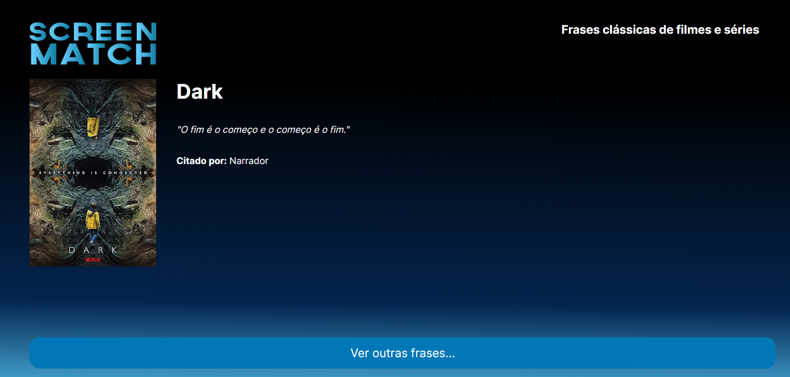

# 🎬 Screenmatch Frases 🎥

**Screenmatch Frases** é um projeto desenvolvido como parte do desafio **Oracle Next Education**. Este repositório é dedicado a armazenar e gerenciar as frases mais icônicas das séries que todos amamos, com um back-end Java e um front-end em HTML e JavaScript.

## 📜 Descrição

No mundo das séries, algumas frases são inesquecíveis. **Screenmatch Frases** coleta essas pérolas e compartilhá-las com o mundo. Desenvolvida com uma arquitetura MVC e uma interface amigável, esta aplicação facilita o armazenamento, visualização e edição de frases marcantes de diversas séries.

## 🚀 Tecnologias Utilizadas

Este projeto é uma combinação das seguintes tecnologias:

### Back-end

- **Java 17+**: A linguagem poderosa que forma a base do servidor.
- **Spring Boot**: Framework que facilita a criação de aplicações Java, proporcionando configuração mínima.
- **JPA/Hibernate**: Para mapeamento objeto-relacional e persistência de dados, garantindo fácil integração com o banco de dados.
- **MySQL 8+**: Sistema de gerenciamento de banco de dados relacional utilizado para armazenar as frases.

### Front-end

- **HTML5**: Linguagem de marcação para estruturação das páginas web.
- **CSS3**: Para estilização e design responsivo.
- **JavaScript**: Para interatividade e manipulação dinâmica de conteúdo na web.
  
### Ferramentas

- **Maven**: Gerenciador de dependências e automação de build.
- **Git**: Controle de versão para gerenciar alterações no código.
- **Postman**: Utilizado para testar as APIs REST de forma prática e eficiente.

---

Desenvolvido com 💖 por [wataredev](https://github.com/wataredev) como parte do desafio **Oracle Next Education**.
